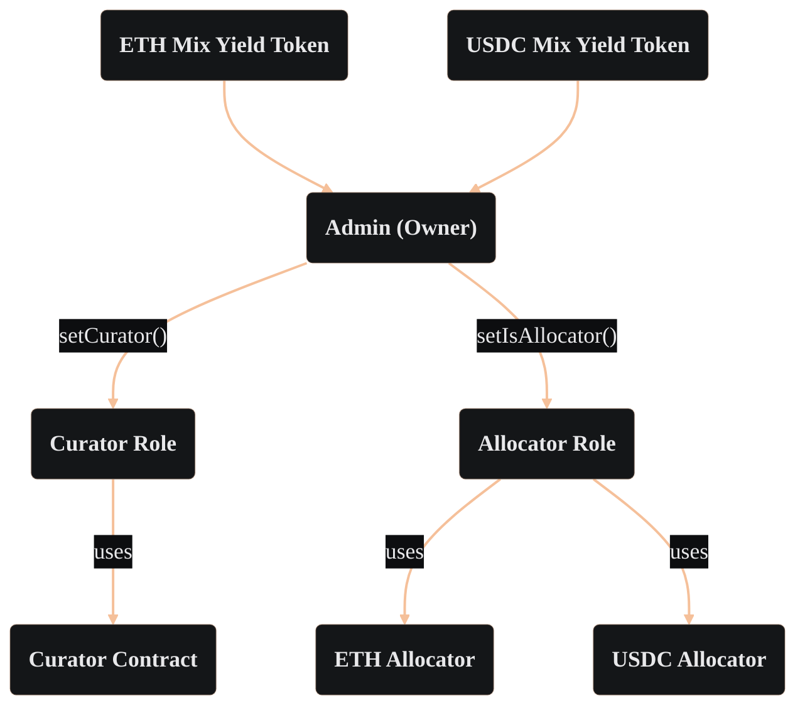

import PageBanner from "@site/src/components/PageBanner";
import AllocationFlow from "@site/src/components/AllocationFlow";

<PageBanner title="MYT Operator Cheatsheet" />

Quick reference for admins, curators, and allocators operating an MYT vault.

## Contract Structure and Roles

The MYT Admin assigns curators and allocators. Curators operate via the Curator contract. Allocators operate via the Allocator contract.

## Allocation Flow

<AllocationFlow />

## Reference: Amount Encoding

| Token | Decimals | Example (1 unit) |
|-------|----------|-----------------|
| USDC  | 6        | `1_000_000`     |
| wETH  | 18       | `1_000_000_000_000_000_000` |
| Relative Cap (100%) | 18 | `1e18` |

All amounts are `uint256`.

## Quick Reference: Key Functions

### MYT Contract *(Owner only)*

| Function | Description |
|----------|-------------|
| `setKillSwitch(bool)` | Enable/disable the kill switch |
| `setCurator(address)` | Assign the Curator role |
| `setIsAllocator(address, bool)` | Assign/revoke the Allocator role |

### Curator Contract *(Curator role)*

| Step | Function | Notes |
|------|----------|-------|
| 1 of 2 | `submitIncreaseAbsoluteCap(strategy, amount)` | Must call before actual txn |
| 2 of 2 | `increaseAbsoluteCap(strategy, amount)` | Uses token decimals (USDC=6, wETH=18) |
| 1 of 2 | `submitIncreaseRelativeCap(strategy, amount)` | Must call before actual txn |
| 2 of 2 | `increaseRelativeCap(strategy, amount)` | 100% = `1e18` |

### Allocator Contract *(Allocator role)*

| Function | Notes |
|----------|-------|
| `allocate(strategy, amount)` | Contract address, uint256 amount (USDC = 6 decimals) |
