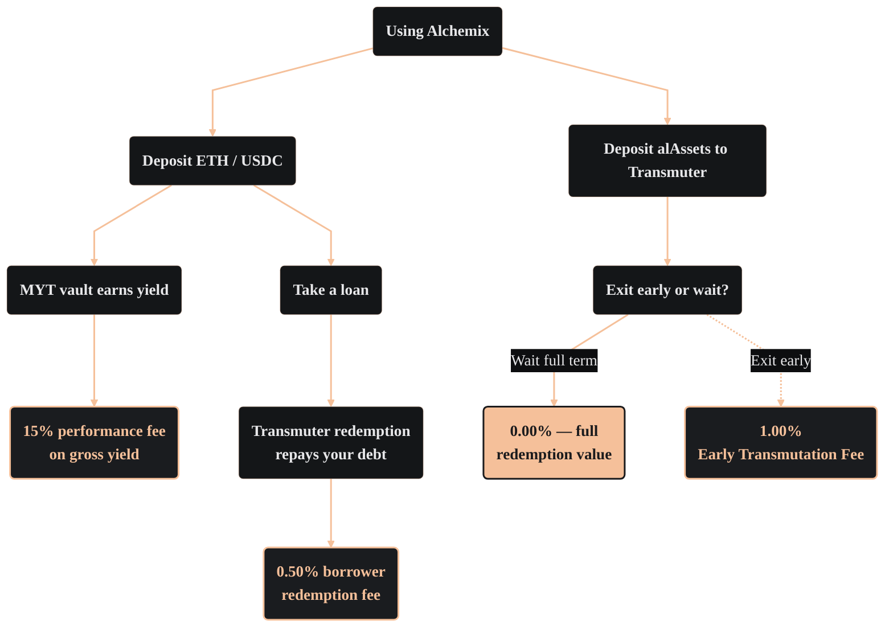

import PageBanner from "@site/src/components/PageBanner";

<PageBanner title="Fees" />

All Alchemix v3 fees are set by on-chain governance and fall into three areas: redemption-based fees for borrowers and transmuters, an early-exit fee for queued assets, and a performance fee on yield generation.

### Borrower redemption fee

When the <Term id="transmuter">Transmuter</Term> converts queued alAssets into vault value, it credits that amount against outstanding loans. At that moment, a small fraction of the repaid debt is routed to the protocol treasury.

- **Current Rate:** 0.50%
- **Effective Cost:** Because this is event-based rather than time-based, the cost depends on your starting <Term id="ltv">LTV</Term> and the duration of the transmutation.

Effective APR ≈ Fee × (1 year ÷ Transmutation Time) × Starting LTV

### Transmuter fees

The Transmuter involves two distinct fee types depending on the user's action:

1. **Redemption Fee:** An optional fee applied when a Transmuter depositor claims their underlying assets.
   - **Current Rate:** 0.00%
2. **Early Transmutation Fee:** A fee applied when a user chooses to withdraw their funds from the Transmuter queue before the transmutation process is complete. This ensures the system remains stable and penalizes short-term "queue hopping."
   - **Current Rate:** 1.00%

### MYT performance fee

Each <Term id="myt">Mix-Yield Token (MYT)</Term> vault skims a share of the gross yield generated by its underlying strategies before crediting the remainder to the MYT price. This fee funds strategy maintenance and ongoing protocol development.

- **Current Rate:** 15.00% (pending final DAO verification)

### Current fee schedule

| Chain        | Base Asset | Redemption Fee | Transmuter Fee | Early Transmutation Fee | MYT Yield Fee |
| :----------- | :--------- | :------------- | :------------- | :---------------------- | :------------ |
| **Ethereum** | ETH        | 0.50%          | 0.00%          | 1.00%          | 15.00%        |
| **Ethereum** | USDC       | 0.50%          | 0.00%          | 1.00%          | 15.00%        |
| **Optimism** | ETH        | 0.50%          | 0.00%          | 1.00%          | 15.00%        |
| **Optimism** | USDC       | 0.50%          | 0.00%          | 1.00%          | 15.00%        |
| **Arbitrum** | ETH        | 0.50%          | 0.00%          | 1.00%          | 15.00%        |
| **Arbitrum** | USDC       | 0.50%          | 0.00%          | 1.00%          | 15.00%        |

:::note Governance oversight
All parameters are subject to Alchemix DAO oversight. Any updates to the fee schedule are executed on-chain and are visible within the Alchemix UI before taking effect.
:::
