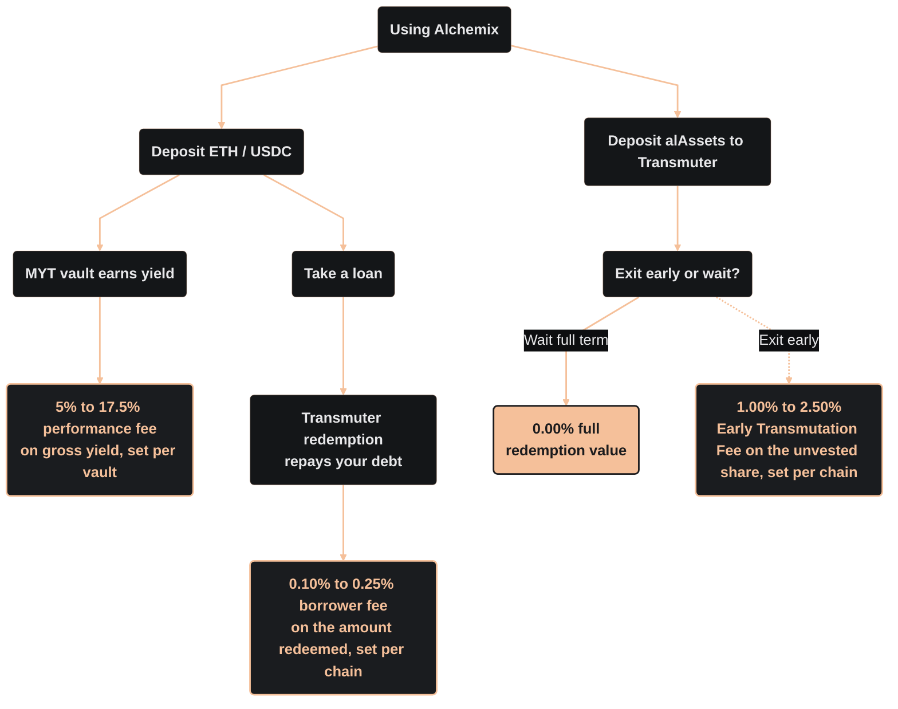

import PageBanner from "@site/src/components/PageBanner";
import { FeeValue, FeeSchedule } from "@site/src/components/FeeValue";

<PageBanner title="Fees" />

All Alchemix v3 fees are on-chain parameters set by the protocol admin multisig under DAO governance. They fall into three areas: redemption-based fees for borrowers and transmuters, an early-exit fee for queued assets, and performance fees on yield generation. A separate [liquidator fee](#liquidator-fee) applies only to liquidated positions.

```mermaid
%%{init: {
  'theme': 'base',
  'themeVariables': {
    'fontFamily': 'Montserrat',
    'primaryColor': '#141618',
    'primaryBorderColor': 'rgba(245,192,154,0.25)',
    'primaryTextColor': '#e8e8ea',
    'lineColor': '#f5c09a',
    'edgeLabelBackground': '#0d0e10',
    'tertiaryColor': '#141618',
    'fontSize': '18px'
  },
  'flowchart': { 'curve': 'linear', 'nodeSpacing': 70, 'rankSpacing': 80 }
}}%%
flowchart TD
    classDef default font-weight:bold;
    classDef fee fill:#1a1c1f,stroke:#f5c09a,stroke-width:2px,color:#f5c09a;
    classDef free fill:#f5c09a,stroke:#1b1b1d,stroke-width:2px,color:#1b1b1d;

    A(Using Alchemix) --> B(Deposit ETH / USDC)
    A --> C(Deposit alAssets to Transmuter)

    B --> D(MYT vault earns yield) --> E(<b>5% to 17.5%</b> performance fee<br/><span style='color:#8a8f99'>on gross yield, set per vault</span>):::fee
    B --> F(Take a loan) --> G(Transmuter redemption<br/>repays your debt) --> H(<b>0.10% to 0.25%</b> borrower fee<br/><span style='color:#8a8f99'>on the amount redeemed, set per chain</span>):::fee

    C --> I(Exit early or wait?)
    I -->|Wait full term| J(<b>0.00%</b> full<br/>redemption value):::free
    I -.->|Exit early| K(<b>1.00% to 2.50%</b><br/><span style='color:#8a8f99'>Early Transmutation Fee on the unvested share, set per chain</span>):::fee

    linkStyle 0,1,2,3,4,5,6,7,8,9 stroke:#f5c09a,stroke-width:2px
```

### Borrower redemption fee

When a <Term id="transmuter">Transmuter</Term> position is claimed, the redeemed amount is cancelled from outstanding loans and pulled from borrower collateral in MYT. At that moment, an additional fee, a small percentage of that value, is taken from collateral and routed to the protocol fee receiver.

The fee is charged on the amount redeemed in each event, and on that amount only. The collateral that stays in your position and the debt that has not yet been redeemed carry no fee. Take a position with 10 ETH of collateral and 2 alETH of debt. If a redemption clears 0.5 alETH of that debt, 0.5 ETH of MYT leaves the position to settle it and the fee is 0.25% of that 0.5 ETH, which is 0.00125 ETH of MYT. The remaining 9.5 ETH of collateral and 1.5 alETH of debt are untouched.

The same rate applies whenever earmarked debt is settled, whatever triggers the settlement: a force-repay during a liquidation or self-liquidation, or your own repayment of earmarked debt with MYT or the underlying asset. In each case the fee is taken on the earmarked portion being settled, so the small protocol fees you see on those events are this borrower redemption fee. Repaying debt that has not been earmarked carries no fee.

- **Current Rate:** <FeeValue metric="redemption" /> on Ethereum, Optimism, and Arbitrum, <FeeValue metric="redemption" chain="base" /> on Base. The rate is set per chain by governance.
- **Effective Cost:** Because the fee is charged per redemption, what it costs you over a year depends on how much of your debt is redeemed in that year. That comes down to your starting <Term id="ltv">LTV</Term> and the duration of the transmutation.

Effective APR ≈ Fee × (1 year ÷ Transmutation Time) × Starting LTV

This gives the cost as a share of your collateral per year. It assumes the Transmuter queue equals total system debt, which is the maximum redemption rate. When the queue is smaller, a smaller share of your debt is redeemed each year and the effective cost is lower.

### Transmuter fees

The Transmuter involves two distinct fee types depending on the user's action:

1. **Transmuter Fee:** An optional fee applied when a Transmuter depositor claims their underlying assets.
   - **Current Rate:** <FeeValue metric="transmuter" />
2. **Early Transmutation Fee:** A fee applied to the unvested alAssets returned when a depositor claims before maturity. The vested portion is still paid out in MYT and is not charged this fee. Vesting is linear over the term, so the split follows the time elapsed: exit three quarters of the way through and three quarters of the deposit is paid out in MYT in full, while the fee is charged only on the remaining quarter, which is returned as alAssets. The fee keeps the system stable and discourages short-term "queue hopping."
   - **Current Rate:** <FeeValue metric="earlyExit" /> on Ethereum, Optimism, and Base, <FeeValue metric="earlyExit" chain="arbitrum" /> on Arbitrum. The rate is set per chain by governance.

### MYT performance fee

Each <Term id="myt">Mix-Yield Token (MYT)</Term> vault skims a share of the gross yield generated by its underlying strategies before crediting the remainder to the MYT price. The fee is taken from yield only, so a vault that earns nothing charges nothing, and your principal is never charged. This fee funds strategy maintenance and ongoing protocol development. The rate is set per vault.

- **Current Rate:** <FeeValue metric="myt" /> on Ethereum. See the schedule below for every chain.

### Ecosystem vault fee

The Alchemix Ecosystem Vault is a curated vault that deploys deposited WETH across a mix of Alchemix v3 yield sources (liquidity pools, Mix-Yield Tokens, and Fixed-Yield Transmuter positions) to earn a blended yield. It takes a share of that yield before crediting the remainder to depositors. It currently runs as a single WETH vault on Ethereum.

- **Current Rate:** 20.00% of yield

### Liquidator fee

Whoever liquidates an unhealthy position is paid a fee for doing so. In a partial liquidation the fee is a percentage of the position’s surplus collateral, meaning the collateral value above the debt, and it comes out of the position together with the collateral seized. In a full liquidation the fee is the same percentage of the position’s debt and is paid from a separate fee vault, so nothing beyond the seized collateral is taken from the position. A self-liquidation pays no liquidator fee. See [Liquidations](./liquidations.md) for when each case applies.

- **Current Rate:** <FeeValue metric="liquidator" />

### Current fee schedule

These values are read live from the fee parameters on each chain's contracts.

<FeeSchedule />

:::note Governance oversight
All parameters are subject to Alchemix DAO oversight. Any updates to the fee schedule are executed on-chain and become visible within the Alchemix UI when they take effect.
:::
