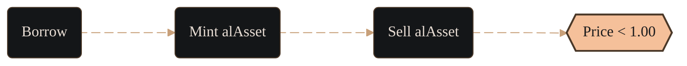
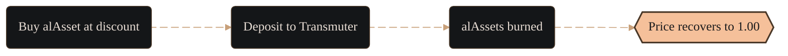

import PageBanner from "@site/src/components/PageBanner";

<PageBanner title="How the Peg Works" />

alAssets are the synthetic debt tokens in which loans are denominated, which are soft-pegged rather than hard-pegged. The protocol does not forcibly fix their price at 1.00 but relies on market incentives and redemption mechanics to pull the price back toward parity after short-term drifts.

**How the soft-peg works:** Inside the vault 1 alAsset always cancels 1 unit of debt, even if that token trades at a discount on exchanges. Fixed-duration redemptions and arbitrage tighten the gap, so price tends to revert without an explicit hard-peg.

## Why price drifts happen

### Expansion – Borrowing & sale

When vault yield and redemption terms look attractive, borrowing spikes. Newly minted alAssets are often sold for the underlying or supplied single-sided to LPs, creating sell pressure and widening the discount.

### Contraction – Transmuter demand

A wider discount plus a fixed-term Transmuter deposit produces a bond-like APR. Traders buy cheap alAssets, deposit them. The protocol earmarks an equal slice of collateral, transfers it to the Transmuter, and burns the alAssets at maturity. Supply contracts and price moves back towards peg.

Borrowing becomes less attractive while the redemption queue is large, so the system naturally flips between expansion and contraction until equilibrium is reached.

## Key points to remember

- Borrowing expands supply and can push alAsset price below par.

- Transmuter deposits contract supply and earn fixed yield, pulling price back.
