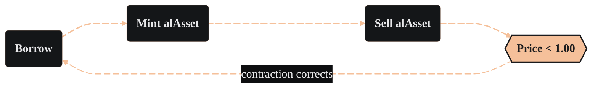
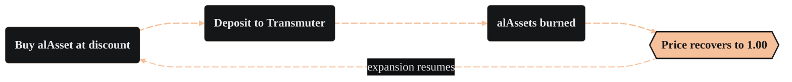

import PageBanner from "@site/src/components/PageBanner";

<PageBanner title="How the Peg Works" />

<Term id="alasset">alAssets</Term> are the tokens you borrow against your collateral. Their price floats near 1.00, but the protocol never forcibly pins it there. Market incentives and redemption mechanics do the work of pulling price back to parity after short-term drifts.

**How the soft-peg works:** Inside the vault 1 alAsset always cancels 1 unit of debt, even if that token trades at a discount on exchanges. Fixed-duration redemptions and arbitrage tighten the gap, so price tends to revert without an explicit hard-peg.

### Why price drifts happen

#### Expansion – Borrowing & sale

When vault yield and redemption terms look attractive, borrowing spikes. Newly minted alAssets are often sold for the underlying or supplied single-sided to LPs, creating sell pressure and widening the discount.

#### Contraction – Transmuter demand

A wider discount plus a fixed-term <Term id="transmuter">Transmuter</Term> deposit produces a bond-like APR. Traders buy cheap alAssets, deposit them. The protocol earmarks an equal slice of collateral, transfers it to the Transmuter, and burns the alAssets at maturity. Supply contracts and price moves back towards peg.

Borrowing becomes less attractive while the redemption queue is large, so the system naturally flips between expansion and contraction until equilibrium is reached.

#### External utility – Holding instead of selling

alAssets are now externally priceable through dedicated [Chronicle Labs](./alAssets.md#using-alassets-across-defi) oracles, so holders can deploy them as collateral in other DeFi protocols rather than selling them. Every holder who puts an alAsset to work elsewhere instead of selling it removes a unit of sell pressure, reinforcing the price and supporting the peg alongside the Transmuter.

### Key points to remember

- Borrowing expands supply and can push alAsset price below par.

- Transmuter deposits contract supply and earn fixed yield, pulling price back.

- External composability (via Chronicle oracles) lets holders use alAssets elsewhere instead of selling, reducing sell pressure.
