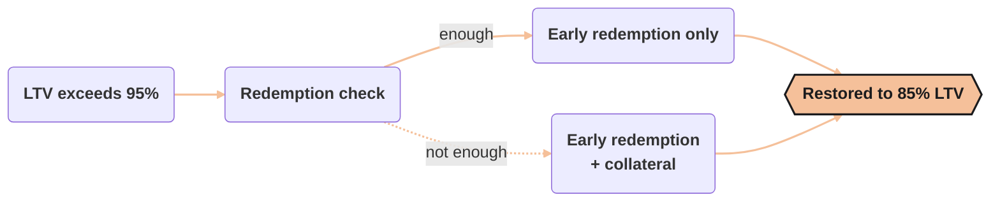

import PageBanner from "@site/src/components/PageBanner";
import StatStrip from "@site/src/components/StatStrip";

<!-- TODO -->

<PageBanner title="Liquidations" />

Liquidations in Alchemix v3 are a system-wide safety valve, not a per-account punishment. Because loans and collateral are like-kind, with ETH backing alETH and USDC backing alUSD, market price swings do **not** force positions to close. The back-stop only activates if the Mix-Yield Token itself loses backing.

:::tip Liquidations in Alchemix are rare
Price volatility alone cannot trigger a liquidation. Only a loss in the underlying yield strategy, such as an exploit or a strategy reporting negative returns, can move the liquidation threshold. Day-to-day, most users will never encounter one.
:::

### When liquidation does not occur

<StatStrip items={[
  { label: "ETH or USDC price volatility",       value: "None, debt and collateral move together." },
  { label: "alAsset drifting below peg on DEXs", value: "None, protocol still values alAssets at face value for repayment." },
  { label: "Hitting the 90% LTV borrowing cap",  value: "Borrowing stops, the position stays open and keeps earning yield." },
]} />

### What can trigger liquidation

<StatStrip items={[
  { label: "Strategy loss, exploit, or severe slippage inside MYT", value: "Oracle shows MYT NAV is less than system debt." },
  { label: "Position exceeds liquidation threshold (95% LTV)",      value: "Oracle shows collateral value vs. debt ratio breaching threshold." },
]} />

### How the process works

When a position crosses 95% LTV, the protocol checks whether triggering an early redemption alone is enough to bring it back to 85%. If yes, only the redemption runs. If not, it runs the redemption first, then uses collateral to cover the rest.

{/* TODO: diagram — decision flowchart for liquidation paths needs a better shape

*/}

- **Partial liquidation** — only the minimum needed to reach 85% LTV is liquidated. The rest of the position is untouched.

- **Liquidator fee** — paid on both paths. If the position’s collateral isn’t enough to cover it, a separate fee vault (fundable by the DAO or any entity) covers the difference.

### Reading the health bar

The colored bar in the vault UI gives an at-a-glance view of three numbers:

- **Current LTV** – your live leverage, updated in real time.

- **Max LTV** – the borrowing ceiling on the vault. You cannot mint alAssets beyond this green marker.

- **Liq LTV** – the red marker shows the liquidation threshold right now. If MYT ever records a loss, the marker slides left to reflect the reduced backing. If your current LTV remains below this marker, you will not be liquidated.

Day-to-day most users will never see a liquidation. If MYT vaults experience a loss, these mechanisms ensure losses are covered in a transparent and proportional way.

Review the MYT strategy breakdown and risk categories before choosing your LTV. The DAO sets a maximum percentage of the MYT that may be allocated to high and medium risk categories, which gives you a basis for calculating a safe LTV below the liquidation threshold.
