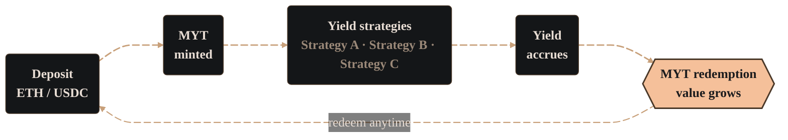

import PageBanner from "@site/src/components/PageBanner";

<PageBanner title="Mix-Yield Token" />

Mix-Yield Token (MYT) gives you passive exposure to a curated set of yield strategies without needing to manage positions yourself. Each token represents a share of assets that the Alchemix DAO allocates across multiple protocols.

[Explore technical documentation for MYT →](../../dev/myt/myt-contract)

### What is MYT?

- **Tokenized basket** – MYT is a customized vault token utilizing Morpho V2's open-source infrastructure. It holds deposits of ETH or USDC and routes them into several yield sources.

- **DAO-managed allocation** – The Alchemix DAO selects strategies, sets target weights, and rebalances as markets shift.

- **Powered by open-source infrastructure** – The core Alchemix vault logic utilizes Morpho's open-source v2 vaults layer to optimize on-chain execution and safety.

### Why use MYT?

|                 |                                                                                          |
| --------------- | ---------------------------------------------------------------------------------------- |
| Passive income  | Each deposit gives you diversified yield without manual re-staking.                      |
| Risk management | DAO oversight, strategy diversification and rebalancing reduce single-protocol exposure. |
| Flexibility     | Choose the chain and bundle that suit your goals, redeem at any time.                    |

### Per-chain variants

There is one ETH-denominated and one USDC-denominated MYT on every supported chain. Strategies differ by chain, letting you choose the profile that matches your preferences. These strategies can change with DAO-issued votes.

You can view the current strategy breakdowns [directly in the UI →](https://alchemix.fi/)

### Depositing and earning

1. Select the MYT that matches your base asset and preferred chain.

2. Deposit ETH or USDC, and the vault will mint MYT at the current exchange rate. As yield accrues, each MYT represents an increasing claim on the underlying asset.

3. Hold MYT. As strategies earn yield, the redemption value of each token increases.

4. Redeem at any time for your principal plus any accumulated yield.

There are no lock-ups, and yield compounds continuously.

