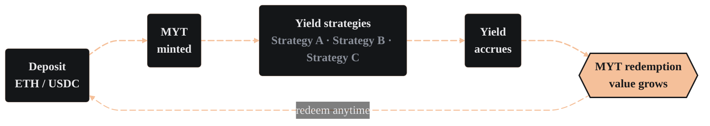

import PageBanner from "@site/src/components/PageBanner";
import FeatureCards from "@site/src/components/FeatureCards";

<PageBanner title="Mix-Yield Token" />

Mix-Yield Token (MYT) gives you passive exposure to a curated set of yield strategies without needing to manage positions yourself. Each token represents a share of assets that the Alchemix DAO allocates across multiple protocols.

[Explore technical documentation for MYT →](../../dev/myt/myt-contract)

### What is the MYT?

- **Open-source core** – MYT is a customized vault token built on Morpho Vaults V2 (ERC-4626). It holds deposits of ETH or USDC and routes them into several yield sources.

- **DAO-managed allocation** – The Alchemix DAO selects strategies, sets target weights, and rebalances as markets shift. Allocation is currently executed by the Alchemix DAO Multisig and is transitioning to full on-chain DAO governance.

### Why use the MYT?

<FeatureCards items={[
  {
    title: "Passive income",
    body: "Each deposit gives you diversified yield without manual re-staking.",
  },
  {
    title: "Risk management",
    body: "DAO oversight and strategy diversification reduce single-protocol exposure.",
  },
  {
    title: "Flexibility",
    body: "Choose the chain and bundle that suit your goals, redeem at any time.",
  },
]} />

### Depositing and earning

1. Select the MYT that matches your base asset and preferred chain.

2. Deposit ETH or USDC, and the vault will mint MYT at the current exchange rate. As yield accrues, each MYT represents an increasing claim on the underlying asset.

3. Hold MYT. As strategies earn yield, the redemption value of each token increases.

4. Redeem at any time for your principal plus any accumulated yield.

There are no lock-ups, and yield compounds continuously. You can also use your MYT as collateral in an Alchemix vault to [borrow up to 90% LTV](./self-repaying-loans.md) against it while it keeps earning underneath.

### Per-chain variants

There is one ETH-denominated and one USDC-denominated MYT on every supported chain (on Mainnet these are branded **mixETH** and **mixUSD**). Strategies differ by chain, letting you choose the profile that matches your preferences. These strategies can change with DAO-issued votes.

:::info Compositions change, verify in the app
The tables below are a point-in-time snapshot for reference. The DAO can revote strategy weights at any time, so always check the live composition, risk tiers, and allocations [in the Mixed Yield tab →](https://alchemix.fi/mixed-yield)
:::

The strategy labels below map to their underlying providers: `Euler*` = Euler v2, `TokeAuto*` = Auto Finance, `Aave*` = Aave, `Fluid*` = Fluid, `Yearn`/`yv*` = Yearn, `wstETH` = Lido, `weETH` = Ether.fi, `sfrxETH` = Frax, `SiUSD` = InfiniFi.

The audit that covers each strategy is listed on the [Security & Audits](../safety/security#strategy-audit-coverage) page.

<!--
LiqAdapter column removed 2026-07-20, pending verification. Do not restore without a
definition and confirmed values.

Values as they stood when removed (originals from commit e16a577, 2026-04-10):

  Mainnet USDC    EulerUSD -, TokeAutoUSD -, Yearn yvUSD Yes, SiUSD -
  Mainnet ETH     Yearn yvWETH Yes*, TokeAutoETH Yes, wstETH -, weETH -*, sfrxETH -*
  Arbitrum USDC   AaveUSDC Yes, EulerUSDC -, FluidUSDC -
  Arbitrum ETH    AaveETH Yes, EulerETH -
  Optimism USDC   AaveUSDC Yes
  Optimism ETH    AaveETH Yes*, wstETH -

  * = inferred from the pattern below, never confirmed by the team.

In the original April data, "Yes" correlated perfectly with the Conservative tier across
all 11 rows, which suggests it tracks the contract-based (non-DEX) unwind path that earns
a Conservative classification.
-->

#### Mainnet USDC

| Strategy | Risk | Max % |
|---|---|---|
| EulerUSD | Moderate | 25% |
| TokeAutoUSD | Moderate | 25% |
| Yearn yvUSD | Conservative | - |
| SiUSD | Moderate | 25% |

#### Mainnet ETH

| Strategy | Risk | Max % |
|---|---|---|
| Yearn yvWETH | Conservative | - |
| TokeAutoETH | Moderate | 25% |
| wstETH | Moderate | 25% |
| weETH | Moderate | 25% |
| sfrxETH | Moderate | 25% |

#### Arbitrum USDC

| Strategy | Risk | Max % |
|---|---|---|
| AaveUSDC | Conservative | - |
| EulerUSDC | Moderate | 25% |
| FluidUSDC | Moderate | 25% |

#### Arbitrum ETH

| Strategy | Risk | Max % |
|---|---|---|
| AaveETH | Conservative | - |
| EulerETH | Moderate | 25% |

#### Optimism USDC

| Strategy | Risk | Max % |
|---|---|---|
| AaveUSDC | Conservative | - |

#### Optimism ETH

| Strategy | Risk | Max % |
|---|---|---|
| AaveETH | Conservative | - |
| wstETH | Moderate | 25% |

#### Global Risk Caps

Each strategy's risk classification caps how much of an MYT it can occupy, both individually and across all strategies of that tier. See [MYT Launch Strategies](../../governance/guides/myt-strategies) for the full classification methodology.

| Risk Level | Max Individual Strategy | Max All Strategies |
|---|---|---|
| Conservative | None | None |
| Moderate | 25% | 40% |
| Aggressive | 10% | 10% |

