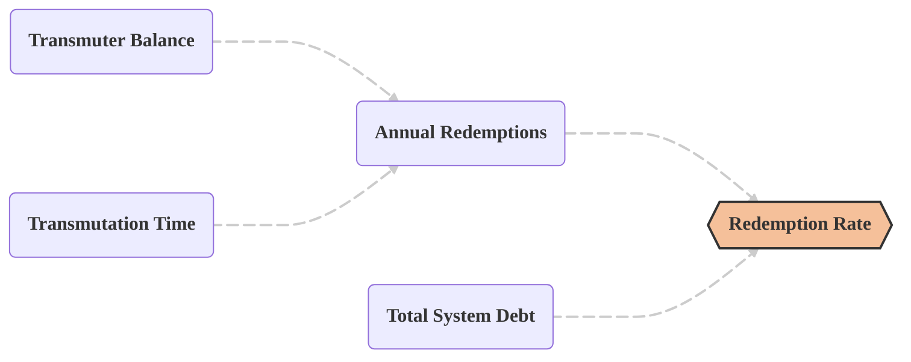
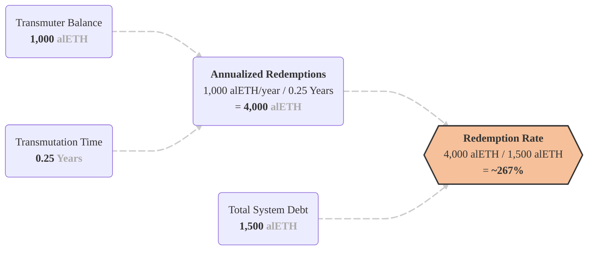

import redemption from '@site/static/img/redemption-rate-01.png';

<!-- TODO -->

<!-- # Redemption Rate -->

Redemptions convert earmarked collateral into the asset required to repay debt.

Two ideas matter:

- **Redemption rate** – how fast the system deleverages your position.
  - **Note:** Because debt and collateral are like kind, deleveraging does not lose the user any money (besides the redemption fee). This is different than many systems that charge interest rates that can at times be higher than the yield you are earning.

- **Temporal advantage** – the bonus yield you earn while waiting for an earmarked redemption to settle.

## The Redemption Rate

The redemption rate tells borrowers what share of total system debt redemptions will repay in one year through the Transmuter. A higher rate means loans clear more quickly.

### Formula

#### Understanding the inputs

The redemption rate formula calculates how much of the total system debt can be cleared in one year, based on current conditions.

- **The Inputs:** We take the current **Transmuter Balance** and the **Transmutation Time** (how long it takes for one batch of assets to be exchanged).
- **The Frequency:** We calculate how many times the Transmuter can cycle its balance in a single year (EG; a 0.25-year duration means 4 cycles per year).
- **The Volume:** By multiplying the balance by the frequency of redemptions, we get the **Projected Annual Redemptions**, the total value the system is on track to repay over the next 12 months.
- **The Rate:** Finally, we compare that projected volume against the **Total System Debt** to determine the percentage rate.

#### Example

If 1000 alETH sit in the Transmuter, the transmutation term is three months (0.25 years), and the Alchemist reports 1500 alETH of debt:

At that rate, the scheduled redemptions would repay roughly 2.67 times the current debt over a twelve-month horizon, meaning the average loan would clear well before a year has passed, assuming queue size, term length, and debt levels remain unchanged.

### What drives this number

| On-chain variable  | Effect on the rate           | Rationale                                                                                                                                          |
| ------------------ | ---------------------------- | -------------------------------------------------------------------------------------------------------------------------------------------------- |
| Queued alAssets    | ↑ Larger queue → higher rate | More alUSD or alETH waiting in the Transmuter funds more repayments. Arbitrage deposits enlarge this queue when the market price drifts below peg. |
| Total system debt  | ↓ More debt → lower rate     | A bigger denominator dilutes the impact of a fixed queue.                                                                                          |
| Transmutation time | ↑ Shorter term → higher rate | Each unit of queued alAsset cycles more often over a year.                                                                                         |

## Temporal Advantage

Earmarking in Alchemix v3 differs from typical redemption systems. In many protocols, once debt is queued for repayment the matching collateral is sold immediately and stops earning. In v3, the system only flags (earmarks) the portion of collateral needed, but leaves it earning until a Transmuter position actually matures. The transfer out of the vault happens at that maturity moment, when the claim must be settled.

Throughout that waiting period your full deposit continues to earn yield, giving you an extra return we’ve coined “temporal advantage”. The longer the gap between earmark and settlement, the more additional yield you collect before the earmarked amount finally goes toward your debt.

## Further Reading

- [**Transmuter Mechanics**](./transmuter.md) – How earmarking and redemption batches work.

- [**Live And Historic Graphics**](https://alchemix.fi/) – View past and present data directly in the dapp.
