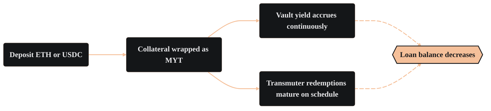

import PageBanner from "@site/src/components/PageBanner";

<PageBanner title="Self-Repaying Loans" />

A self-repaying loan lets you unlock liquidity without immediately selling your core position.

Deposit ETH or USDC and the vault issues a like-kind synthetic asset, alETH or alUSD, that mirrors the price of what you deposited. You may mint <Term id="alasset">alAssets</Term> worth up to **90%** of your collateral's face value and deploy them however you like. Meanwhile, two built-in cash flows reduce the loan balance:

- **Vault yield** – Your collateral is wrapped in the <Term id="myt">Mix-Yield Token</Term>, which earns yield continuously.

- **Scheduled redemptions** – As <Term id="transmuter">Transmuter</Term> redemption positions mature, users will redeem their positions, which then triggers debt repayments using user collateral.

Because repayment comes from these predictable flows, the loan never accrues variable interest. The balance of your debt only moves in one direction (down) unless you choose to mint additional alAssets.

:::tip You are in control
While Alchemix loans repay themselves over time via yield, you are never locked in. You can manually repay part or all of your debt at any time to unlock your collateral immediately.
:::

| | |
| --- | --- |
| **Collateral** | ETH → alETH, USDC → alUSD |
| **Maximum LTV** | 90% |
| **Interest rate** | 0% (balance declines, never compounding) |
| **Repayment sources** | MYT yield, scheduled transmuter redemptions, manual repayments |
| **Early repayment** | Send alAssets back at any time |
| **Position NFT** | Your position is represented by an NFT available in your wallet after the transaction confirms |
| **Liquidation** | Liquidations are extremely unlikely, but redemptions are applied to your share of the debt, thus affecting high LTV users more |

### What can self-repaying loans be used for?

- **Large purchases** – Access liquidity today without selling your position. No interest rate and no price-based liquidations means you don't need to watch the loan closely.

- **Yield looping** – Deposit borrowed alAssets into new positions for amplified yield.

- **IL protection** – Combine borrowing with like-for-like liquidity pools to generate fees without impermanent loss.

- **Short-term opportunities** – Quickly move capital while keeping your underlying position intact.

- **F.I.R.E-style loans** – Schedule periodic draws while your principal continues earning.

### Managing your position

For most borrowers, the position is low-maintenance. Deposit, mint, and check back when you need more liquidity. Active users can raise or lower their <Term id="ltv">LTV</Term>, loop alAssets back into the vault for leverage, or time repayments around redemptions.

### Learn more

[alAssets: synthetic tokens explained →](./alAssets.md)

[The Transmuter: how redemptions work →](./transmuter.md)

[Tutorial: Take a Loan →](../tutorials/borrowing-in-alchemix.md)
