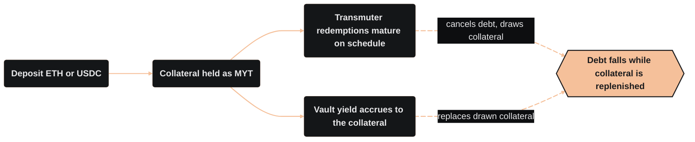

import PageBanner from "@site/src/components/PageBanner";

<PageBanner title="Self-Repaying Loans" />

A self-repaying loan lets you unlock liquidity without immediately selling your core position.

Deposit ETH or USDC and the vault issues a like-kind synthetic asset, alETH or alUSD, that mirrors the price of what you deposited. You may mint <Term id="alasset">alAssets</Term> worth up to **90%** of your collateral's face value and deploy them however you like. Meanwhile, two things happen to the position without any action from you:

- **Scheduled redemptions pay down the debt** – As <Term id="transmuter">Transmuter</Term> positions mature and are redeemed, the protocol takes <Term id="myt">MYT</Term> worth the redeemed amount out of your collateral and cancels the same amount of your debt. This is the only automatic repayment mechanism.

- **Vault yield refills the collateral** – Your collateral is held as MYT, which keeps earning while it sits in the vault. Yield does not reduce your debt directly. It replaces some or all of the collateral that redemptions remove, so your net value can hold steady or grow while the debt falls depending on LTV and current rates.

Because debt and collateral are like-kind, each redemption reduces both by the same value. The loan never accrues interest, and the balance of your debt only moves in one direction (down) unless you choose to mint additional alAssets.

:::tip You are in control
Redemptions repay the loan over time, but you are never locked in. You can manually repay part or all of your debt at any time to unlock your collateral immediately.
:::

```mermaid
%%{init: {
  'theme': 'base',
  'themeVariables': {
    'fontFamily': 'Montserrat',
    'primaryColor': '#141618',
    'primaryBorderColor': 'rgba(245,192,154,0.25)',
    'primaryTextColor': '#e8e8ea',
    'lineColor': '#f5c09a',
    'edgeLabelBackground': '#0d0e10',
    'tertiaryColor': '#141618',
    'fontSize': '18px'
  },
  'flowchart': { 'curve': 'monotoneX', 'nodeSpacing': 80, 'rankSpacing': 90 }
}}%%
flowchart LR
    classDef default font-weight:bold;

    A(Deposit ETH or USDC) --> B(Collateral held as MYT)
    B --> C(Vault yield accrues to the collateral)
    B --> D(Transmuter redemptions mature on schedule)
    D e1@-->|cancels debt, draws collateral| E{{Debt falls while collateral is replenished}}
    C e2@-->|replaces drawn collateral| E

    style E fill:#f5c09a,stroke:#1b1b1d,stroke-width:2px,color:#1b1b1d
    linkStyle 0,1,2,3,4 stroke:#f5c09a,stroke-width:2px
    e1@{ animation: slow }
    e2@{ animation: slow }
```

| | |
| --- | --- |
| **Collateral** | ETH → alETH, USDC → alUSD |
| **Maximum LTV** | 90% |
| **Interest rate** | 0% (balance declines, never compounding) |
| **Repayment sources** | Scheduled Transmuter redemptions (drawn from your collateral) and manual repayments |
| **Vault yield** | Accrues to your MYT collateral and offsets what redemptions draw. It does not reduce debt directly |
| **Early repayment** | Repay at any time with alAssets (unearmarked debt), or with MYT or the underlying asset (any debt, including earmarked) |
| **Position NFT** | Your position is represented by an NFT available in your wallet after the transaction confirms |
| **Liquidation** | Only a loss of value in the MYT itself can push a position past the 95% threshold. Redemptions lower your LTV, since they cancel debt and collateral in equal amounts |

### What can self-repaying loans be used for?

- **Large purchases** – Access liquidity today without selling your position. No interest rate and no price-based liquidations means you don't need to watch the loan closely.

- **Yield looping** – Swap borrowed alAssets for the underlying asset and deposit it into a new position for amplified exposure to MYT yield.

- **IL mitigation** – Combine borrowing with like-for-like liquidity pools to generate fees, with impermanent loss limited to moves in the alAsset’s peg.

- **Short-term opportunities** – Quickly move capital while keeping your underlying position intact.

- **F.I.R.E-style loans** – Schedule periodic draws while your principal continues earning.

### Managing your position

For most borrowers, the position is low-maintenance. Deposit, mint, and check back when you need more liquidity. Active users can raise or lower their <Term id="ltv">LTV</Term>, loop alAssets back into the vault for leverage, or time repayments around redemptions.

### Learn more

[alAssets: synthetic tokens explained →](./alAssets.md)

[The Transmuter: how redemptions work →](./transmuter.md)

[Tutorial: Take a Loan →](../tutorials/borrowing-in-alchemix.md)
