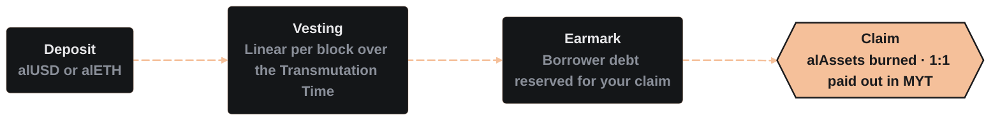

import PageBanner from "@site/src/components/PageBanner";

<PageBanner title="Transmuter" />

The Transmuter lets you redeem <Term id="alasset">alAssets</Term> (alUSD, alETH, and alUSDb on Base) at a 1:1 rate after a known waiting period. You buy below face value and receive the full value on the maturity date, paid as an equal value of <Term id="myt">MYT</Term> that normally unwraps to the underlying asset immediately.

:::tip Instant vs. fixed-rate liquidity
The Transmuter pays out at a **1:1 exchange rate** (no market slippage) but works over time as positions vest. Payouts are scaled down only if the Alchemist carries bad debt (see Edge-case handling below).

- **Want it now?** Use external liquidity pools (Curve, Balancer) which are instant but may have slight price slippage.
- **Want 1:1 value?** Deposit into the Transmuter and wait for redemptions to clear over a fixed period to fill your order.
:::

### How transmutations flow

- **Deposit** – Send alUSD or alETH to the Transmuter contract.
- **Vesting** – Each deposit vests linearly over the Transmutation Time, a duration set per asset and chain by the protocol admin under DAO governance and adjusted over time in response to market factors such as Transmuter capacity and demand. Always check the current term for your asset in the [dapp](https://alchemix.fi/fixed-yield) before depositing. You can exit early with the vested share paid out, and the unvested share returned as alAssets minus the early exit fee.
- **Earmark** – As your position vests, the protocol earmarks a matching amount of borrower debt. That debt can only be settled with <Term id="myt">MYT</Term> collateral, which stays in place and keeps earning until you claim.
- **Claim** – You receive 1 asset-worth of MYT from borrower collateral for every 1 alAsset that has vested. You can claim at any time after maturity, and the claimed alAssets are burned.

All redeemed alAssets are burned, contracting their supply.

### Why discounts exist

Borrowers often sell newly minted alAssets for working capital, pushing market price slightly below par. The spread between that market price and the Transmuter’s fixed 1:1 accounting creates a fixed-rate opportunity for buyers.

Inside Alchemix, 1 alUSD offsets 1 USD worth of debt at face value, regardless of its external market price (debt already earmarked for redemption is settled with MYT instead).

#### Fixed-rate yield example

The figures below are **illustrative only**. The live market price is set by trading, the transmutation term is set per asset and chain by the protocol admin under DAO governance, and the resulting APR comes from both. Always check the current terms in the [dapp](https://alchemix.fi/fixed-yield).

**Market**: alUSD = 0.96 USDC

**Term**: 90 days

| Action                  | Outcome                                    |
| ----------------------- | ------------------------------------------ |
| Buy alUSD               | Spend 10,000 USDC → receive \~10,416 alUSD |
| Deposit into Transmuter | Locks the 10,416 alUSD for 90 days.        |
| At maturity             | Receive 10,416 USDC (via MYT)              |
| Profit                  | 416 USDC = 4.16% in 3 mo = \~16.6% APR     |

:::warning Transmuter deposit caps
The Transmuter has a deposit cap set per chain, and it can never hold more alAssets than the paired Alchemist has issued. If a Transmuter is full, you may need to bridge alAssets to another chain to deposit.

**Always verify available Transmuter capacity on your target chain before purchasing alAssets.**
:::

### Edge-case handling

| Scenario                             | Result                                                                                                                | Your Options                                                                                                   |
| ------------------------------------ | --------------------------------------------------------------------------------------------------------------------- | -------------------------------------------------------------------------------------------------------------- |
| Bad debt in Alchemist (exploit, etc) | Redemption pays pro-rata (e.g., 0.97:1) until debt is restored.                                                         | Claim now and take a haircut, or leave unclaimed. Once debt clears, you may redeem full 1:1.                   |
| MYT unwrap slippage                  | In some scenarios MYT may not be able to be immediately unwrapped for the underlying (e.g., the UI detects high slippage). | Withdraw MYT from the Transmuter to begin earning yield from it, then unwrap manually later, facilitated directly by the UI. |

There is no variable interest and no price-based liquidation affecting Transmuter positions.

### Strategic uses

- **Arbitrage & peg maintenance** – capture fixed yield while pulling alAssets back to parity.

- **LP protection** – LPs can move alAssets from liquidity pools into the Transmuter to erase impermanent loss if the peg widens.

- **Treasury management** – DAOs can park stable reserves for a known return without rate risk.

- **Diversified yield stacking** – pair Transmuter returns with base vault yield for stacked APR.
